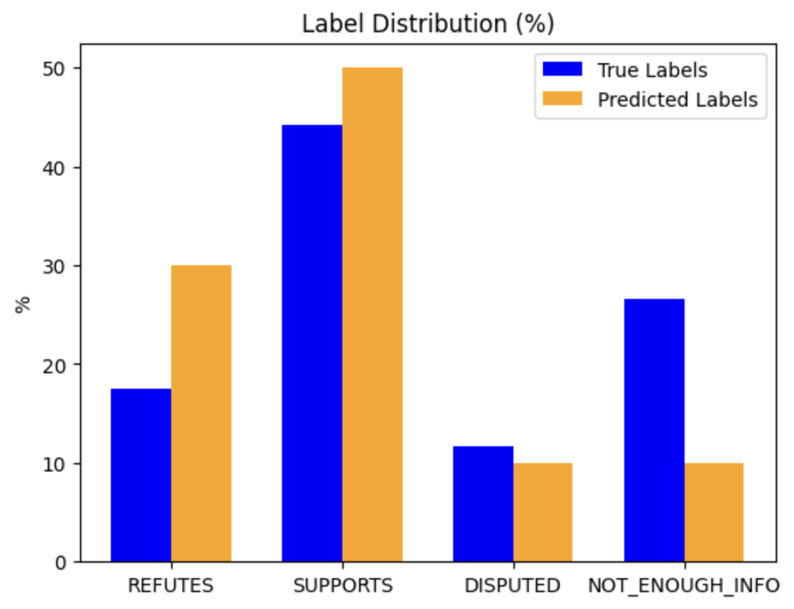

# Fact Checker for Climate

This repository aims to create a machine fact checker for climate claims, utilizing BERT for embedding creation and fine-tuning. Given a set of ground truths stored in (`evidence.json`, which was not uploaded due to its large size), the fact checker classifies climate-related claims into four categories: `REFUTES`, `SUPPORTS`, `DISPUTED`, and `NOT_ENOUGH_INFO`.

## Data

The data used in this project are sourced from COMP90042, University of Melbourne.

## Requirements

- [Colab](https://colab.research.google.com/)

## Result

- test set accuracy: 0.49
- test set F1 score: 0.46

The original task's test set is unlabeled, so this project used its development/validation set as the test set.

## Project Background

This project is a modification of Project 3 from Natural Language Processing (COMP90042) at the University of Melbourne, Semester 1, 2024.
